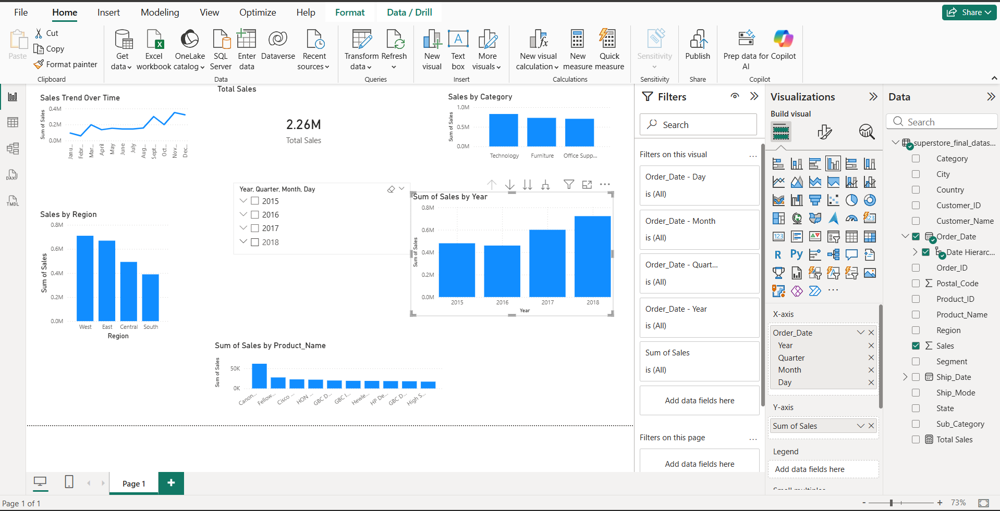

# Superstore Sales Analysis Dashboard (Power BI)

## Project Overview
Developed an interactive Power BI dashboard to analyze retail sales data and identify performance trends across regions and categories.

## Tools Used
- Power BI
- DAX
- Data Modeling

## Key Analysis Performed
- Year-wise sales trend analysis (2015–2018)
- Regional sales performance comparison
- Category-level revenue insights
- KPI tracking using interactive slicers

## Key Insights
- West region contributed the highest revenue.
- Technology category showed strong performance.
- Sales trends showed variation across different years.

## Business Value
The dashboard supports data-driven decision-making by providing interactive and visual sales performance insights.
